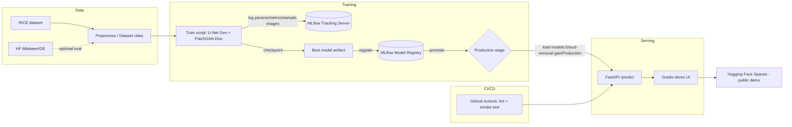

# Architecture — Cloud Removal MLOps Project

## 1. High-level flow



## 2. Repository layout

```
cloud-removal-mlops/
├── docs/
│   ├── PRD.md
│   ├── TECH_STACK.md
│   ├── ARCHITECTURE.md
│   ├── PROJECT_PLAN.md
│   └── AGENTS.md
├── data/
│   ├── raw/                  # downloaded RICE / DE data (gitignored)
│   ├── MANIFEST.json         # dataset hash + source manifest (lightweight DVC substitute)
│   └── dataset.py            # PyTorch Dataset/DataLoader for RICE (+ DE)
├── model/
│   ├── networks.py           # U-Net generator, PatchGAN discriminator (adapted from pix2pix fork)
│   ├── train.py              # training loop, MLflow logging
│   └── eval.py               # PSNR/SSIM eval on held-out split
├── serving/
│   ├── api.py                 # FastAPI app: /predict, /health
│   ├── inference.py           # loads Production model from MLflow registry, runs generator
│   └── demo_app.py            # Gradio app calling the API (or model directly)
├── mlflow/
│   └── docker-compose.yml     # MLflow tracking server (SQLite backend + local artifact store)
├── tests/
│   ├── test_dataset.py
│   ├── test_model.py
│   └── test_api.py
├── .github/workflows/
│   └── ci.yml                 # lint + smoke test
├── Dockerfile                 # shared image, entrypoint switches train/serve
├── requirements.txt
├── .env.example
└── README.md
```

## 3. Component responsibilities

### Data layer (`data/`)
- `dataset.py` exposes a `RiceCloudDataset(Dataset)` returning `(cloudy_tensor, clean_tensor)` pairs.
- Splits: train/val/test (e.g. 80/10/10), fixed random seed for reproducibility.
- `MANIFEST.json` records source URL, download date, and a hash per file — the
  traceability DVC would give us, without DVC's setup cost.

### Model layer (`model/`)
- `networks.py`: U-Net generator (encoder-decoder + skip connections), PatchGAN
  discriminator — adapted from the pix2pix reference implementation, not
  written from scratch.
- `train.py`:
  - Wraps training in `with mlflow.start_run():`
  - Logs: `lr`, `batch_size`, `epochs`, `dataset_version` (from MANIFEST hash) via `mlflow.log_params`
  - Logs per-epoch G-loss/D-loss via `mlflow.log_metric`
  - Logs a sample before/after image grid every N epochs via `mlflow.log_artifact`
  - At the end, logs the model via `mlflow.pytorch.log_model(...)`
- `eval.py`: loads a checkpoint, computes PSNR/SSIM over the test split, logs
  those as metrics on the same MLflow run.

### MLflow layer (`mlflow/`)
- A tracking server (`mlflow server --backend-store-uri sqlite:///mlflow.db
  --default-artifact-root ./mlruns`) running in its own lightweight container.
- Both engineers point `MLFLOW_TRACKING_URI` at this shared instance.
- Model Registry: after eval, the best run's model is registered as
  `cloud-removal-gan`, and the winning version is transitioned:
  `None → Staging → Production` via the MLflow client API or UI.

### Serving layer (`serving/`)
- `inference.py`: single function `load_production_model()` that pulls
  `models:/cloud-removal-gan/Production` from the registry — this is the
  detail that ties serving to the registry rather than a hardcoded checkpoint path.
- `api.py`: FastAPI with:
  - `POST /predict` — accepts an image upload, returns the cloud-removed image
  - `GET /health` — basic liveness check
- `demo_app.py`: Gradio interface, either calling the FastAPI endpoint over
  HTTP or importing `inference.py` directly for simplicity in the demo build.

### CI/CD (`.github/workflows/ci.yml`)
- Job 1: `ruff` lint.
- Job 2: smoke test — instantiate dataset (tiny fixture subset), run 1
  training step, run 1 forward pass through `inference.py`. This proves the
  pipeline isn't broken without requiring a GPU or full training run in CI.

### Deployment
- Gradio app (`demo_app.py`) pushed to a Hugging Face Space (Gradio SDK).
- The Space either bundles a small pinned checkpoint directly, or (if time
  allows) calls out to a hosted FastAPI instance — default to bundling the
  checkpoint for simplicity/reliability of the public demo.

## 4. Data flow contract (interfaces between the two people's work)

This is the seam between Person A (modeling) and Person B (infra) — freeze
this early so both can work in parallel without blocking each other:

- **Checkpoint format:** generator weights saved as a standard PyTorch
  `state_dict` inside an `mlflow.pytorch` logged model — Person B builds
  `inference.py` against this contract before Person A's real weights exist,
  using a randomly initialized model as a stand-in.
- **Image contract:** input/output images are RGB, normalized to `[-1, 1]`
  (standard pix2pix convention), resized to 256×256. Both API and training
  code must agree on this exact preprocessing — put it in one shared
  `transforms.py` imported by both `dataset.py` and `inference.py`.
- **Registry contract:** the model name is always `cloud-removal-gan`; the
  API only ever asks for the `Production` alias, never a specific version
  number, so re-promoting a new model requires no code change in serving.

## 5. What's explicitly NOT in this architecture (see PRD Non-Goals)
- No message queue / async job system for inference (synchronous `/predict` only).
- No authentication layer on the API.
- No autoscaling / load balancing.
- No drift detection or monitoring dashboards.
- No multi-temporal or SAR data path (SEN12MS-CR-TS excluded).
